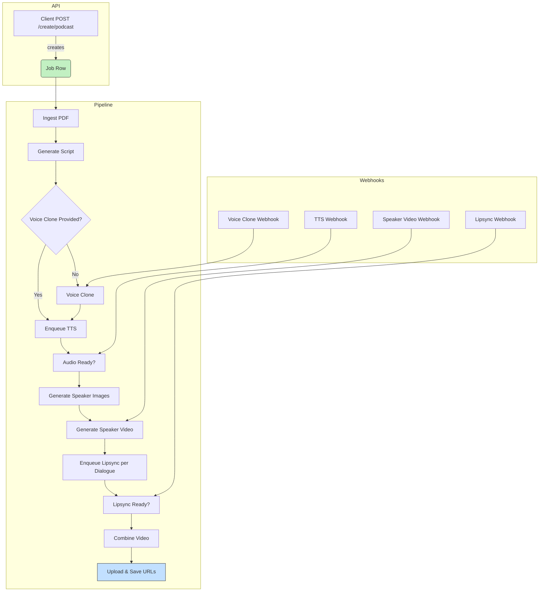

# Podcast Generator API Documentation

## Overview

The Podcast Generator API allows you to create high-quality AI-generated podcast videos. The system orchestrates a complex pipeline including script generation, voice cloning, audio synthesis, image processing, video generation, and lipsync processing to create the final podcast video.

## Endpoints

The endpoints will be as follows:

### api/podcast/create/script/monologue

It will use chatgpt4o latest via OpenRouter API. The variable for that is `OPENROUTER_API_KEY`. The payload will take in prompt and an optional PDF which will be fed to the LLM to generate a podcast script as a monologue.

**Request Parameters:**
- `prompt` (string, required): Main idea or topic for the podcast
- `pdf_content` (string, optional): Base64 encoded PDF content for additional context
- `speaker_name` (string, optional): Name of the speaker for the monologue

**Response:**
- JSON containing the generated script and processing information

### api/podcast/create/script/dialogue

It will use chatgpt4o latest via OpenRouter API. The variable for that is `OPENROUTER_API_KEY`. The payload will take in prompt and an optional PDF which will be fed to the LLM to generate a podcast script as a dialogue. The output will be a JSON file which will have the conversation like `<speaker 1>: <speaker 1 dialogue 1>`, `<speaker 2>: <speaker 2 dialogue 1>` and so on.

**Request Parameters:**
- `prompt` (string, required): Main idea or topic for the podcast
- `pdf_content` (string, optional): Base64 encoded PDF content for additional context
- `speaker1_name` (string, required): Name of the first speaker
- `speaker2_name` (string, required): Name of the second speaker

**Response:**
- JSON containing the generated dialogue script with alternating speakers

### api/podcast/create/podcast/monologue

This will create a complete podcast video based on a monologue format.

**Request Parameters:**
- `speaker_audio_sample` (URL, conditional): Mandatory if voice clone ID is not given
- `speaker_voice_clone_ID` (string, conditional): Mandatory if audio sample is not given
- `speaker_name` (string, optional): Optional because speaker ID will be an auto-generated UUID which will end with speaker name if provided i.e. `<UUID>-<speaker name>`
- `speaker_image` (URL, conditional): Mandatory if speaker_video not provided. Should be a high-quality picture
- `speaker_video` (URL, conditional): Mandatory if speaker_image not provided. Should be a 10-second clip of 1080p quality
- `prompt` (string, required): The topic or idea for the podcast
- `background_image_reference` (URL, optional): Default will be a standard podcast studio in our Digital Ocean Spaces
- `webhook_url` (URL, optional): If provided, all image and video generation tasks will send updates to this URL. A Podcast Job ID will be created to track all the individual tasks and overall progress.

**Workflow:**
1. Creates a script for monologue using OpenRouter API
2. Breaks the script into sentences for audio generation using Minimax Speech 02 HD Replicate API
3. Clones voice for speaker using Minimax Voice Clone Replicate API if audio sample is provided, or uses the provided voice clone ID
4. Generates images in podcast setting for the speaker using Flux Kontext Pro Replicate API
5. Uses provided or default background image with speaker using Flux Kontext Multi-List Replicate API
6. Generates video for the speaker using Kling 1.6 Pro Replicate API
7. Lipsyncs the video with audio using Kling Lipsync Replicate API
8. Stitches separate videos together in order according to the script to create a final monologue podcast video

**Response:**
- Job ID for tracking the progress
- Initial status information
- URL to check status updates

### api/podcast/create/podcast/dialogue

This will create a complete podcast video based on a dialogue format between two speakers.

**Request Parameters:**
- `speaker1_audio_sample` (URL, conditional): Mandatory if voice clone ID is not given
- `speaker1_voice_clone_ID` (string, conditional): Mandatory if audio sample is not given
- `speaker1_name` (string, required): Name of the first speaker
- `speaker1_image` (URL, conditional): Mandatory if speaker1_video not provided
- `speaker1_video` (URL, conditional): Mandatory if speaker1_image not provided
- `speaker2_audio_sample` (URL, conditional): Mandatory if voice clone ID is not given
- `speaker2_voice_clone_ID` (string, conditional): Mandatory if audio sample is not given
- `speaker2_name` (string, required): Name of the second speaker
- `speaker2_image` (URL, conditional): Mandatory if speaker2_video not provided
- `speaker2_video` (URL, conditional): Mandatory if speaker2_image not provided
- `prompt` (string, required): The topic or idea for the podcast dialogue
- `background_image_reference` (URL, optional): Default will be a standard podcast studio
- `webhook_url` (URL, optional): For receiving status updates on all tasks

**Workflow:**
Similar to the monologue workflow but processes two speakers and alternates between them in the final video according to the dialogue script.
1. **Script Creation**: Use OpenRouter API to generate a monologue script based on the provided prompt and optional PDF content. The script will be saved in the project folder.

2. **Voice Cloning**: If an audio sample is provided, use Minimax Voice Clone Replicate API to create a voice clone for the speaker. Otherwise, use the provided voice clone ID.

3. **Audio Generation**: Break the script into sentences and generate audio using Minimax Speech 02 HD Replicate API. This audio will be synchronized with the speaker's voice clone.

4. **Image Generation**: Use Flux Kontext Pro Replicate API to generate images of the speaker in a podcast setting. If a background image is not provided, use a default podcast studio background.

5. **Video Creation**: Generate a video of the speaker using Kling 1.6 Pro Replicate API. The video will include the generated images and background.

6. **Lipsync Processing**: Lipsync the generated video with the audio using Kling Lipsync Replicate API to ensure synchronization between audio and video.

7. **Final Video Assembly**: Stitch together the lipsynced video clips according to the script order to create the final monologue podcast video.

8. **Job Tracking and Updates**: Assign a Podcast Job ID to track all tasks, send status updates to the provided webhook URL, and store final media URLs and status in the database.

### api/podcast/status/{job_id}

Retrieves the current status of a podcast generation job.

**Response:**
- Detailed status information about each step in the podcast creation process
- URLs to any completed outputs (script, audio, videos)
- Error information if any step has failed

## Webhook Endpoints

These URLs are automatically called by external services (Replicate, Minimax, etc.) to report task completion. They all expect a **GET** query parameter named `secret` to validate the request.

| Purpose | URL Pattern | Notes |
|---------|-------------|-------|
| Voice-clone completion | `/api/audio/webhooks/voice-clone/{job_id}/{speaker_num}/?secret=...` | `speaker_num` is **1** or **2**. Updates the speaker voice-ID and enqueues audio generation for that speaker’s dialogues. |
| Dialogue-audio completion | `/api/audio/webhooks/dialogue-audio/{job_id}/{dialogue_id}/?secret=...` | Marks a `PodcastDialogue` as `audio_completed` and triggers video readiness checks. |
| Speaker-video completion | `/api/video/webhooks/speaker-video/{job_id}/{speaker_num}/?secret=...` | Saves the speaker video URL and starts lipsync for each dialogue. |
| Lipsync completion | `/api/video/webhooks/lipsync/{job_id}/{dialogue_id}/?secret=...` | Saves the lipsynced clip URL and triggers final-video readiness checks. |
| Final video completion | `/api/video/webhooks/final-video/{job_id}/?secret=...` | Stores the final video URL, marks the job `succeeded`, and (optionally) notifies the client-provided webhook. |

## Environment Variables

Variable | Purpose | Default / Example
---------|---------|------------------
`OPENROUTER_API_KEY` | Access token for OpenRouter (Gemini / GPT-4o)
`REPLICATE_API_TOKEN` | Access token for Replicate models (Kling, Minimax, etc.)
`WEBHOOK_BASE_URL` | Public-facing base URL used to build webhook callback URLs (non-K8s deployments) | `https://api.example.com`
`K8S_WEBHOOK_BASE_URL` | Base URL for webhook callbacks when running inside Kubernetes (`IS_K8S=True`) | `https://api.k8s.example.com`
`DO_SPACES_KEY` / `DO_SPACES_SECRET` / `DO_SPACES_REGION` / `DO_SPACES_ENDPOINT` | DigitalOcean Spaces credentials
`POSTGRES_DB`, `POSTGRES_USER`, `POSTGRES_PASSWORD`, … | PostgreSQL connection (in K8s these come from `MANAGED_*` vars)

## Known Issues & Solutions

| Problem | Symptom | Fix |
|---------|---------|-----|
| **403 Forbidden from DigitalOcean Spaces** | Replicate cannot fetch private object URLs | Use `storage_client.get_accessible_url()` to generate presigned URLs (implemented in both `clone_voice` and `generate_minimax_voice_clone`). |
| **Missing DB tables after deployment** | `relation "podcast_generator_podcastgenerationjob" does not exist` on startup | Run `python manage.py makemigrations` for new fields (`speech_job_id`, webhook-secret columns) and apply them. For K8s, use `setup_migrations_k8s.sh`. |
| **Dialogue audio stuck in `audio_processing`** | Minimax job created but webhook never fires | Confirm that `WEBHOOK_BASE_URL` (or `K8S_WEBHOOK_BASE_URL` in K8s) is correct and the service is publicly reachable. |

## 🔬 Detailed Internal Workflow

Below is a **source-of-truth** reference for developers and DevOps engineers.  It mirrors the implementation in `podcast_generator.tasks.*`, `services.PodcastJobService`, and helper scripts under `/scripts`.

### 0.  Document Ingestion  (optional)
1. `POST /api/podcast/create/*` may include a `pdf_content` **or** a `document_source_url`.
2. `ingest_document_for_job` (Celery) downloads the PDF → extracts plain-text with `pdfminer` → saves result to `PodcastGenerationJob.document_content`.
3. When finished it enqueues **script generation**.

### 1.  Script Generation
| Tool | File | Notes |
|------|------|-------|
| OpenRouter GPT-4o | `scripts/generate_monologue_script.py`, `generate_dialogue_script.py` | Prompt template lives in the script.  Uses env `OPENROUTER_API_KEY`. |
| Validation | `podcast_generator.validators.validate_script_json` | Ensures JSON schema compliance before saving. |
| Storage | `storage_client.upload_file` | Raw script is written to `<media_folder>/script.json` then uploaded to DO Spaces. |

Output rows are written to `PodcastDialogue` (one per sentence/utterance, preserving order & speaker).

### 2.  Voice Cloning  (if `*_voice_clone_id` not supplied)
• **Endpoint**: Minimax Voice Clone via Replicate (`scripts/create_voice_clone_minimax.py`)
• Upload speaker sample → receive `voice_id` → persist to `PodcastGenerationJob.*_voice_id`.
• Completion is tracked by `/api/audio/webhooks/voice-clone/{job}/{speaker}`.

### 3.  TTS generation
1. `enqueue_audio_for_all_dialogues` creates a Celery **group** of `generate_tts_for_dialogue` tasks (1 per dialogue row).
2. `generate_tts_for_dialogue` calls Minimax Speech 02 HD via Replicate, waits synchronously when `webhook_url` omitted.
3. MP3/WAV saved to Spaces under `audio/{dialogue_id}.wav` -> URL stored in `dialogue.audio_url`.
4. A chord-callback `check_audio_completion` starts video stage once every dialogue has `audio_url`.

### 4.  Image & Video Generation
| Stage | Model | Task / Script | Concurrency |
|-------|-------|---------------|-------------|
| Speaker still images | Flux Kontext Pro / Multi-List | `scripts/edit_image_kontext_*` | Parallel (one per speaker) |
| Raw speaker video     | Kling v1.6 Pro | Celery `generate_video_for_speakers` → *group* of `generate_video_for_speaker` | Parallel |

Generated videos are stored to Spaces.  `KlingVideoJob` rows keep the Replicate URL + final MP4 URL.

### 5.  Lipsync
`enqueue_lipsync_for_dialogues` iterates over every dialogue and fires `generate_kling_lipsync` (or delegates to `video_generation.tasks.generate_kling_lipsync`) **in parallel**.  Each task:
1. Downloads audio + video (presigned URLs via `storage_client.get_accessible_url`).
2. Calls Kling Lipsync model.
3. Saves synced clip to Spaces (`clips/{dialogue_id}.mp4`).
4. Webhook `/api/video/webhooks/lipsync/...` marks dialogue `video_ready`.

### 6.  Final Assembly
`combine_podcast_video` waits until **all dialogues** have `video_ready` then:

1. Builds a deterministic `filelist.txt` with the synced clip order based on `PodcastDialogue.ordinal`.
2. Runs `ffmpeg -f concat -safe 0 -i filelist.txt -c:v libx264 -pix_fmt yuv420p -c:a aac out.mp4`.
3. Extracts a thumbnail with `ffmpeg -ss 00:00:01 -i out.mp4 -vframes 1 cover.jpg` for frontend preview.
4. Uploads both `out.mp4` and `cover.jpg` via `storage_client.upload_file(...)`, saving URLs back to `PodcastGenerationJob.final_video_url` and `.thumbnail_url`.
5. Transitions job state to **completed** and triggers optional client webhook `/api/podcast/webhooks/final?job_id=...`.

---

#### 🔎 Sub-step breakdown (per stage)

**0 – Document Ingestion**  
• Validate MIME type (`application/pdf`) & file size (<20 MB).  
• `pdfminer.six` extracts text.  
• Update DB: `document_ingestion_status = completed`.

**1 – Script Generation**  
• Prompt template includes podcast style, audience level, and voice persona.  
• Calls OpenRouter `/v1/chat/completions` with `model=gpt-4o-2024-04` temperature 0.8.  
• Parses JSON response; on validation error → retry 2× then fail job.  
• Saves pretty-printed script under `{media_folder}/script.json`.

**2 – Voice Cloning**  
• Audio sample normalized to 16 kHz mono WAV using `ffmpeg`.  
• Posts multipart/form-data to Replicate endpoint.  
• Polls `/predictions/{id}` every 5 s until status `succeeded`.  
• Persists `voice_id` to job row.

**3 – TTS**  
• Splits dialogue text by punctuation regex `[.!?]`.  
• Adds SSML prosody tags (rate, pitch) before sending to Minimax.  
• Streams response to disk in chunks (to avoid RAM spikes).  
• Respects per-minute character quota via Redis counter.

**4 – Image & Video**  
• Image prompts built from speaker metadata + "in podcast studio, 4K ultrarealistic".  
• For dialogue jobs, background image is shared to maximise cache hits.  
• `generate_video_for_speaker` passes `--frame_rate 30 --duration 10` to Kling.  
• Stores intermediate `.gif` preview for dashboard.

**5 – Lipsync**  
• Resamples TTS WAV to 48 kHz required by Kling model.  
• If lipsync fails (>5 min no webhook), task auto-retries with back-off.  
• On success, sets `dialogue.video_ready=True` and `dialogue.clip_url`.

---

### 🗺️ Mermaid Workflow Diagram




---

## 🚧 Known Bottlenecks & Required Optimisations

| Component | Current Latency | Issue |
|-----------|-----------------|-------|
| Kling Lipsync | ~10 min per 10-second clip | Dominates end-to-end latency.  **Must** run fully parallel (N dialogues → N workers) and/or migrate to a lower-latency model. |
| Image→Video (Kling v1.6 Pro) | 3-5 min per 10-sec video | Parallelise per speaker; cache identical reference images. |
| TTS (Minimax Speech 02 HD) | 2 sec per sentence | Run Celery group; adjust batch sizes; explore streaming API to merge requests. |

### Back-pressure strategy
* Use Celery **rate limits** per queue keyed on external provider (Replicate) to avoid 429s.
* Implement `self.retry(countdown=…)` with exponential back-off when HTTP 5xx received.

### Storage
* Presigned URLs currently expire after 1 h (`expires_in=3600`).  Long-running podcasts (>1 h total) may need renewal logic.
* Add periodic cleanup of temp files & unused DO Spaces objects.

---

## 🛡  Production-readiness & Error-handling Checklist

1. **Validation** – DRF serializers in `podcast_generator.serializers` enforce: URL scheme, file size limits, mutually-exclusive fields.
2. **Authentication / Rate-limiting** – add JWT bearer tokens + `rest_framework.throttling`.
3. **Observability** –
   * Structured JSON logging (already via `with_task_logging`).
   * Prometheus metrics: task duration, external API latency, failure counts.
   * Sentry for unhandled exceptions.
4. **Idempotent Webhooks** – compute request hash, ignore duplicates; verify `secret` signature.
5. **Time-outs** – wrap external HTTP calls with `requests` `timeout=60`, abort FFmpeg after `-t` max.
6. **Circuit Breakers / Bulkheads** – track successive failures per provider, temporarily disable calls.
7. **Graceful Retry & Resume** – every Celery task persists partial state before raising; pipeline can resume mid-stage.
8. **Database Migrations** – CI gate that `makemigrations --check` is clean; alembic diff for non-Django consumers.
9. **API Docs** – auto-generate OpenAPI via drf-yasg; include examples per endpoint.
10. **Security** – scan uploaded PDFs (ClamAV) before ingestion; validate content-type of user-provided URLs.

---

## Future Work
* **Dynamic speaker count** (>2) – generalise models & UI.
* **Real-time preview** – stream intermediate clips to client.
* **GPU scheduling** – bin-packing large jobs onto A100 instances.


## Update Log

Date | Change
-----|--------
2025-06-27 | Implemented per-dialogue audio generation (`generate_dialogue_audio` Celery task) and all related webhooks. Added `speech_job_id` field to `PodcastDialogue`.
2025-06-24 | Unified DigitalOcean Spaces handling with multi-fallback download / presigned URLs.
2025-06-20 | Initial redesign: separate endpoints for script vs full podcast, monologue vs dialogue.


# Parallellization of jobs
```PHP
Bus::batch([
   [
      new VoiceCloneJob,
      new TextToSpeech
    ],
    [
       KontextImage
        KlingImageToVideo
    ]
])->finally(fn () => new  KlingLypSinc);
```

```python
from celery import chain, group
from myapp.tasks import (
    voice_clone_job,
    text_to_speech,
    kontext_image,
    kling_image_to_video,
    kling_lyp_sync
)

# Define chained tasks
chain1 = chain(voice_clone_job.s(), text_to_speech.s())
chain2 = chain(kontext_image.s(), kling_image_to_video.s())

# Execute them as a batch
batch = group(chain1, chain2)()

# Add final callback (similar to `finally`)
batch.then(kling_lyp_sync.s())
```
